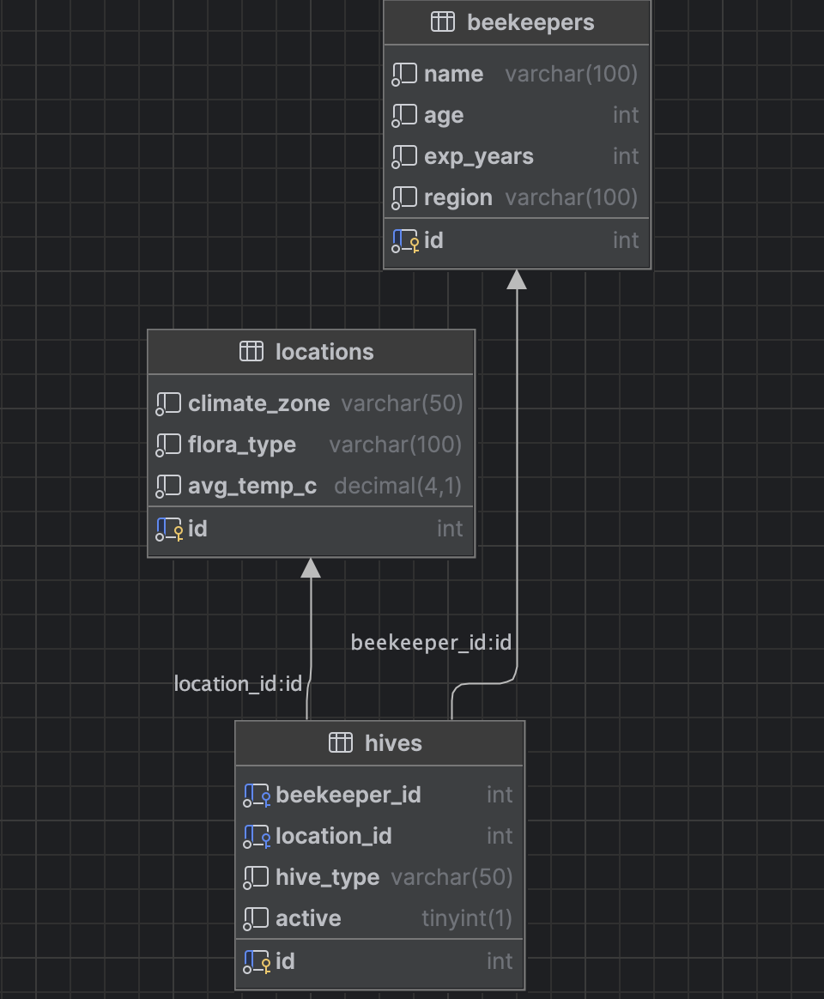

# 🐝 MyBeeQL (MySQL + Docker)

SQL portfolio project to show schema design + queries. Readable on GitHub and runnable with Docker.

## Schema:
<p align="center">
  
</p>

## Run
```bash
docker compose up -d
# wait for "ready for connections"
docker exec -it bees-mysql mysql -ubeekeeper -pmysql -D bees_db -e "SELECT 1;"
```

## Load Schema / Seed

```
docker exec -i bees-mysql mysql -ubeekeeper -pmysql bees_db < schema.sql
docker exec -i bees-mysql mysql -ubeekeeper -pmysql bees_db < seed.sql
```
## Connect (DataGrip / TablePlus)

Host: localhost

Port: 3307

DB: bees_db

User: beekeeper

Pass: mysql

## Files
schema.sql
 – tables/constraints

seed.sql
 – demo rows
 
docker-compose.yml
 – MySQL 8 (container bees-mysql)

## Common commands

## Show tables + sample data
```
docker exec -it bees-mysql mysql -ubeekeeper -pmysql -D bees_db -e "SHOW TABLES; SELECT * FROM beekeepers LIMIT 5;"
```
## Regenerate files from the running DB
```
docker exec bees-mysql mysqldump -ubeekeeper -pmysql --no-tablespaces -d bees_db > schema.sql
docker exec bees-mysql mysqldump -ubeekeeper -pmysql --no-tablespaces --no-create-info --skip-triggers bees_db beekeepers locations hives > seed.sql
```